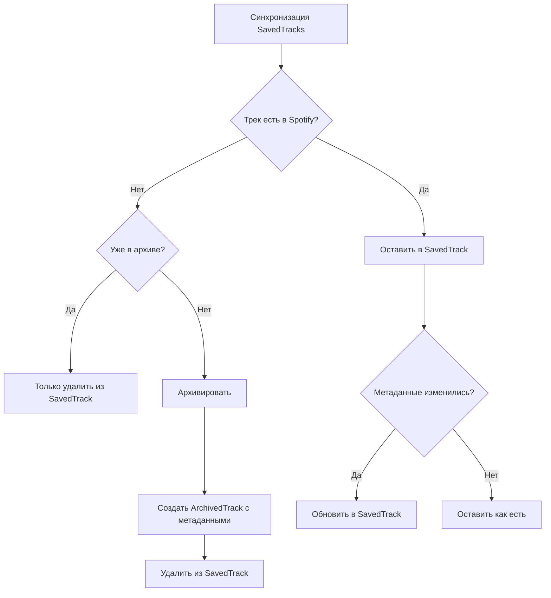

# ТЗ: Архив удаленных избранных треков (Liked Archive)

## 1. Цель

Создать функционал автоматического архивирования треков, которые были удалены из избранного (liked) в Spotify. При удалении трека из сохраненных, он должен добавляться в архивную таблицу с сохранением метаданных.

## 2. Требования к данным

Хранить для каждого архивного трека:
- `trackId` - уникальный ID трека (из Spotify URI)
- `trackUri` - полный Spotify URI
- `trackName` - название трека
- `artistName` - имя основного исполнителя
- `addedAt` - дата и время добавления в избранное
- `removedAt` - дата и время удаления из избранного

## 3. Ожидаемое поведение

1. При запуске сервиса синхронизации избранных треков ничего не меняется.
2. Когда трек удаляется из избранного в Spotify:
   - Он удаляется из таблицы `SavedTrack`
   - Одновременно добавляется в таблицу `ArchivedTrack`
3. В архиве хранятся все удаленные треки (без повторов).
4. Если трек уже есть в архиве - он не архивируется повторно.

## 4. База данных

### Schema

```prisma
model ArchivedTrack {
    trackId    String   @id
    trackUri   String
    trackName  String?
    artistName String?
    addedAt    DateTime
    removedAt  DateTime
    createdAt  DateTime @default(now())

    @@index([trackId])
    @@index([removedAt(sort: Desc)])
}
```

### Индексы
- `trackId` - для быстрого поиска конкретного трека
- `removedAt` - для сортировки по времени удаления

## 5. Архитектура

### 5.1 Расширение типов (types.ts)

Новый интерфейс:
```typescript
export interface ArchivedTrackItem {
  trackId: string;
  trackUri: string;
  trackName: string | null;
  artistName: string | null;
  addedAt: Date;
  removedAt: Date;
}
```

### 5.2 ArchiveRepository

Интерфейс:
- `upsertArchivedTrack(track: ArchivedTrackItem)` - вставка или обновление (на случай повторного архивирования)
- `getArchivedTrack(trackId: string)` - получить один архивный трек
- `getAllArchivedTracks()` - получить все архивные треки
- `getArchivedTrackCount()` - количество архивных треков
- `deleteArchivedTrack(trackId: string)` - удалить из архива (опционально)

### 5.3 Модификация SavedTracksSyncService

Алгоритм синхронизации изменяется:

```
1. Получить текущее состояние из Spotify (все треки)
2. Получить текущее состояние из БД
3. Найти новые треки (есть в Spotify, нет в БД) -> upsert
4. Найти удаленные треки (есть в БД, нет в Spotify) -> 
   a. Переместить в архив (добавить в ArchivedTrack с текущим timestamp)
   b. Удалить из SavedTrack
5. Обновить метаданные для существующих (если изменились)
```

При обнаружении удаленных треков:
- Для каждого удаленного `trackId`:
  1. Проверить, есть ли уже в архиве (есть - пропустить)
  2. Если нет в архиве - получить полную информацию о треке из SavedTrack
  3. Создать запись в ArchivedTrack с:
     - Всеми метаданными трека
     - `removedAt` = текущее время синхронизации
  4. Удалить из SavedTrack

### 5.4 Поток данных



## 6. Конфигурация

Новые env-параметры **не требуются** - функционал автоматически включается при наличии модели в БД.

## 7. Обработка ошибок

- Ошибка при архивировании трека -> записать в лог, НЕ удалять из SavedTrack (чтобы не потерять данные)
- Ошибка при удалении из SavedTrack после архивирования -> продолжить со следующим треком

## 8. Логирование

События:
1. Старт/стоп сервиса (без изменений)
2. Результаты синхронизации: new=X, updated=Y, removed=Z, **archived=Z**
3. Ошибки архивирования

Пример лога:
```
Saved tracks synced: Spotify=100, DB=102, new=0, updated=1, removed=2, archived=2.
```

## 9. Критерии приемки

1. При удалении трека из избранного в Spotify, он автоматически появляется в архиве.
2. В архиве сохраняются все метаданные трека.
3. В архиве сохраняется дата добавления в избранное (`addedAt`).
4. В архиве сохраняется дата удаления (`removedAt`).
5. Повторное удаление того же трека игнорируется (он уже в архиве).
6. Сервис стабильно работает при перезапусках.
7. Ошибка архивирования не блокирует работу сервиса.
