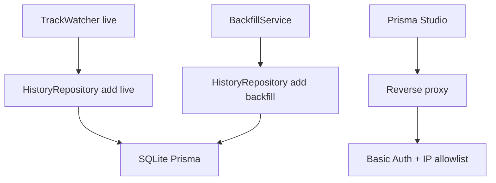

# План реализации: Полная история прослушивания через SQLite + Prisma

## 1. Цель

Перевести хранение истории с файлового state на SQLite через Prisma ORM.

Что должно быть в итоге:
- Полная история с момента включения фичи.
- Только DB-based хранение, без file-based механизма.
- Функционал плейлиста HISTORY [AUTO] полностью удаляется.
- Данные переживают перезапуск/пересоздание контейнера через volume.
- Prisma Studio доступен по ссылке за reverse proxy с Basic Auth и IP allowlist.

## 2. Принятые решения

- База данных: SQLite.
- ORM: Prisma.
- Просмотр данных: Prisma Studio.
- Старый file-based history удаляется после проверки, что от него ничего не зависит.
- Функционал HISTORY [AUTO] удаляется из runtime и конфигурации.

## 3. Версии и компоненты, которые добавляем

Зафиксированные версии для реализации (проверены через npm registry):

- Node.js: `22.x` (в проекте уже используется образ node 22 в [`Dockerfile`](Dockerfile:1))
- SQLite: `3.x` (встроенный движок через Prisma SQLite provider, отдельный сервер не требуется)
- `prisma` (CLI, devDependency): `7.5.0`
- `@prisma/client` (runtime dependency): `7.5.0`

Примечания по фиксации версий:

- `prisma` и `@prisma/client` должны быть одной версии.
- Точные версии дополнительно фиксируются в lock-файле [`package-lock.json`](package-lock.json), чтобы сборка оставалась воспроизводимой.
- При следующем цикле обновления версий нужно повторно проверить npm registry и обновить этот документ.

## 4. Точки системы, которые меняются

- Запись live-событий в callback треков.
- Запись backfill-событий из recently played.
- Удаление зависимостей, связанных с playlist sync для HISTORY [AUTO].
- Конфигурация env и runtime путей.
- Shutdown lifecycle для корректного закрытия PrismaClient.

## 5. Целевая архитектура

## 6. Prisma схема данных

### 5.1 Модель PlayEvent

Поля:
- id String @id @default(cuid())
- trackUri String
- playedAt DateTime
- source enum LIVE or BACKFILL
- observedAt DateTime
- createdAt DateTime @default(now())

Индексы:
- playedAt для быстрых выборок последних N.
- trackUri + playedAt для отчетов и поиска.
- unique trackUri + playedAt для идемпотентности.

### 5.2 Модель AppState

Поля:
- key String @id
- value String
- updatedAt DateTime @updatedAt

Назначение:
- Служебные метаданные и курсоры на будущее.

## 7. Пошаговый план реализации в режиме Code

1. Добавить зависимости с зафиксированными версиями:
   - `npm i @prisma/client@7.5.0`
   - `npm i -D prisma@7.5.0`
   и выполнить инициализацию Prisma.
2. Создать каталог prisma и schema.prisma.
3. Описать модели PlayEvent и AppState.
4. Создать первую миграцию SQLite.
5. Добавить DATABASE_URL в env и config.
6. Реализовать PrismaHistoryRepository.
7. Переключить main и backfill на репозиторий БД.
8. Удалить file-based HistoryStore из runtime потока.
9. Удалить HISTORY_STATE_PATH и HISTORY-плейлист настройки из config и документации.
10. Удалить runtime-компоненты HISTORY [AUTO] (manager/scheduler и связанные вызовы).
11. Добавить graceful shutdown prisma client disconnect.
12. Обновить README и .env.example.
13. Обновить тесты и удалить file-based и playlist-history тесты.

## 8. Обязательная проверка зависимостей перед удалением старого кода

- Проверить импорты HistoryStore по проекту.
- Проверить обращения к HISTORY_STATE_PATH.
- Проверить тесты, завязанные на file-based историю.
- Убедиться, что сборка, линт и тесты проходят.

## 9. Docker и персистентность

Рекомендуемые переменные:
- DATABASE_URL=file:/data/history.db
- TOKEN_STORAGE_PATH=/data/.spotify-tokens.json

Требование:
- Смонтировать persistent volume в /data.
- Без volume данные SQLite будут теряться при recreate контейнера.

Опционально (рекомендуется для production):
- Включить ежедневный бэкап файла SQLite во внешнее S3-хранилище.
- Минимальный формат: архив `history-YYYY-MM-DD.db.gz` + checksum.
- Хранить бэкапы с retention-политикой (например, 30/90 дней).

## 10. Prisma Studio публикация

- Studio запускается на отдельном внутреннем порту.
- Reverse proxy публикует URL только для разрешенных IP.
- На proxy включается Basic Auth.
- Внешний доступ без allowlist запрещен.

## 11. Опциональный ежедневный backup в S3

Цель:
- Иметь внешнюю копию БД на случай повреждения volume/диска.

Минимальный контур реализации:
1. Ежедневный cron-задачей создавать консистентный snapshot БД:
   - через `sqlite3 .backup` (предпочтительно), либо
   - копия файла при гарантированно коротком downtime записи.
2. Архивировать snapshot в `gzip`.
3. Заливать в S3 bucket с префиксом `spotify-helper/history/`.
4. Включить server-side encryption (SSE-S3 или SSE-KMS).
5. Вести lifecycle policy на удаление старых backup-объектов.
6. Добавить проверку восстановления (test restore) не реже 1 раза в месяц.

Рекомендуемые env-переменные (опционально):
- `BACKUP_S3_ENABLED=true|false`
- `BACKUP_S3_BUCKET=...`
- `BACKUP_S3_REGION=...`
- `BACKUP_S3_PREFIX=spotify-helper/history`
- `BACKUP_S3_SSE_MODE=SSE-S3|SSE-KMS`
- `BACKUP_S3_SSE_KMS_KEY_ID=...` (если выбран SSE-KMS)
- `BACKUP_RETENTION_DAYS=90`
- `BACKUP_CRON=0 3 * * *`

## 12. Критерии приемки

- История сохраняется после перезапуска контейнера.
- Функционал HISTORY [AUTO] отсутствует в runtime и документации.
- В runtime нет зависимостей от file-based history.
- Prisma Studio доступен по правилам безопасности.
- Команды npm run build, npm run lint, npm test проходят.
- Если backup включен: ежедневный объект успешно появляется в S3 и проходит проверка восстановления.

## 13. Риски и меры

- Дубликаты live и backfill: использовать unique ключ и идемпотентные операции.
- Блокировки SQLite: короткие транзакции и batch вставки.
- Ошибка публикации Studio: обязательный Basic Auth и IP allowlist.

## 14. Статус

План утвержден для последующей реализации в режиме Code.
